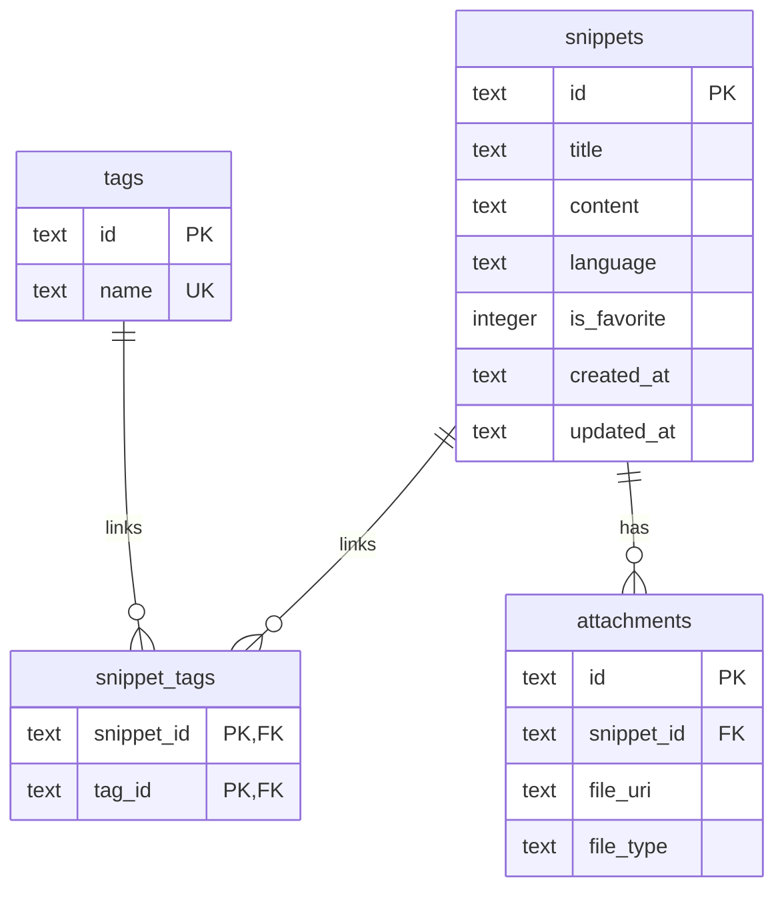
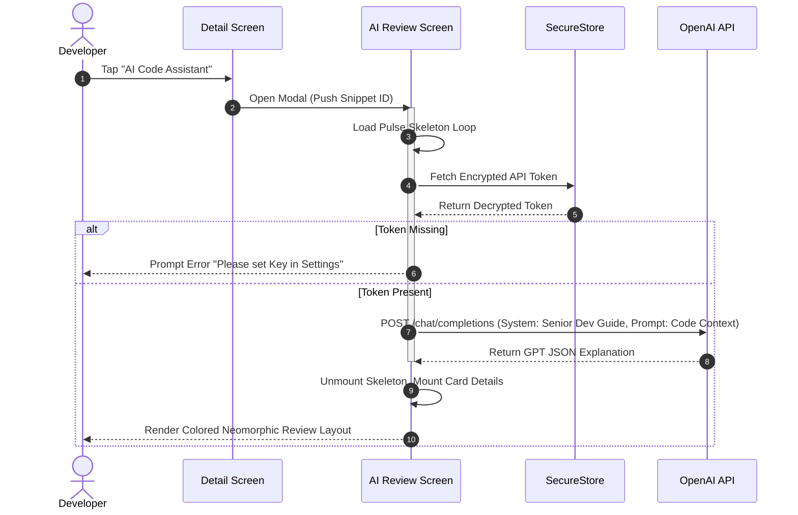

# 🌌 DevVault - Secure Local Code Ledger & Developer Workspace

**DevVault** is a modern, developer-focused offline-first mobile application built using **Expo**, **React Native**, and **TypeScript**. Designed for premium visual excellence and tactility, it allows developers to store, organize, annotate, and understand reusable code snippets securely on-device with zero external database dependencies.

---

## 📅 Timeline & Project Metadata
*   **Project Start:** May 24, 2026, 1:00 PM
*   **Due Date:** May 30, 2026, 11:59 PM
*   **Evaluation Period:** May 31, 2026, 12:30 PM – June 3, 2026, 11:59 PM
*   **Platform Target:** iOS & Android (Tablet supported, predictive back gestures disabled)
*   **Design Framework:** HSL Catppuccin Mocha Dark Theme & Neomorphic Fluidity

---

## 🔗 Project Deliverables
*   **GitHub Repository:** `https://github.com/SarthakGup05/devVault`
*   **Demo Video & Walkthrough:** Available inside the repository as `/assets/recordings/demo.mp4`
*   **Screenshots Showcase:** Stored in `/assets/screenshots/`

---

## 🛠️ Unified Storage & Architectural Layout

DevVault maps distinct local storage technologies to exact security and performance tiers:

| Technology | Purpose & Context | Implementation Details |
| :--- | :--- | :--- |
| **SQLite (`expo-sqlite`)** | Snippet Database | Normalized tables holding local codes, search parameters, creation times, and structural tag lists. |
| **AsyncStorage** | Themes & App Settings | Core preferences, sorting parameters, and active search queries. |
| **SecureStore** | API Keys & Sensitive Data | Encrypted storage of OpenAI/AI provider tokens. |
| **Expo FileSystem** | Image Attachments & File Exports | Copying snippets as `.json`/`.txt` shares; caching screenshots inside local app directories. |

---

## 📊 Database Schema Structure

DevVault runs a relational local database powered by `expo-sqlite`. Foreign key constraints are explicitly enabled at startup (`PRAGMA foreign_keys = ON;`) to guarantee referential integrity and cascade operations.



### Table DDL Specifications

```sql
PRAGMA foreign_keys = ON;

-- 1. Main Snippet Entity
CREATE TABLE IF NOT EXISTS snippets (
  id TEXT PRIMARY KEY NOT NULL,
  title TEXT NOT NULL,
  content TEXT NOT NULL,
  language TEXT NOT NULL,
  is_favorite INTEGER DEFAULT 0,
  created_at TEXT NOT NULL,
  updated_at TEXT NOT NULL
);

-- 2. Unique Tag Registry
CREATE TABLE IF NOT EXISTS tags (
  id TEXT PRIMARY KEY NOT NULL,
  name TEXT UNIQUE NOT NULL
);

-- 3. Many-to-Many Bridge Table
CREATE TABLE IF NOT EXISTS snippet_tags (
  snippet_id TEXT NOT NULL,
  tag_id TEXT NOT NULL,
  PRIMARY KEY (snippet_id, tag_id),
  FOREIGN KEY (snippet_id) REFERENCES snippets (id) ON DELETE CASCADE,
  FOREIGN KEY (tag_id) REFERENCES tags (id) ON DELETE CASCADE
);

-- 4. Local File Attachments Map
CREATE TABLE IF NOT EXISTS attachments (
  id TEXT PRIMARY KEY NOT NULL,
  snippet_id TEXT NOT NULL,
  file_uri TEXT NOT NULL,
  file_type TEXT NOT NULL,
  FOREIGN KEY (snippet_id) REFERENCES snippets (id) ON DELETE CASCADE
);
```

---

## 💾 Offline-First Architecture & Storage Workflow

The application behaves as a local ledger, executing operations locally first and eliminating white/blank latency loading issues:

1.  **Local Read Persistence:** Component mounting triggers quick index selections using `SQLite` transaction batches.
2.  **Instant Search indexing:** Title and content searches are executed directly inside SQLite using wildcard queries:
    ```sql
    SELECT * FROM snippets WHERE title LIKE ? OR content LIKE ?
    ```
3.  **Encrypted Key Verification:** The AI review engine fetches keys on-demand from `SecureStore`. Keys are encrypted via standard OS-level keychains (Keystore on Android, Keychain on iOS), ensuring local security compliance.

---

## 📁 File Management & Attachments

File management uses `expo-file-system` to offer developers absolute workspace control:

*   **Attached Screenshots:** When attaching assets to snippets, DevVault copies the chosen asset to the secure local application directory (`FileSystem.documentDirectory + 'attachments/'`), records the new unique URI in the SQLite `attachments` table, and displays it via cached image loaders.
*   **Local Backups:** Users can execute a secured vault export. The application aggregates snippets into a JSON buffer and writes it safely to a secure local file using the `expo-file-system/legacy` module:
    ```typescript
    import { writeAsStringAsync } from 'expo-file-system/legacy';
    await writeAsStringAsync(fileUri, JSON.stringify(data), { encoding: 'utf8' });
    ```
*   **Share Sheets:** Backups and code files are easily shared with third-party messaging or IDE tools using `expo-sharing`.

---

## 🤖 AI Code Explanation Workflow

Our AI integration features a clean user flow and high visual feedback:



---

## 💎 Premium Bonus Features (Evaluator Highlights)

DevVault moves far beyond minimum viable products, implementing premium design cues that WOW at first glance:

### 1. Translucent Bottom Tab bar & Sliding Active Pill
Replaced generic tab bars with an absolute-positioned floating gadget dock. 
*   **Glassmorphism:** Crafted with a semi-transparent surface (`rgba(49, 50, 68, 0.92)`), glowing primary borders (`rgba(137, 180, 250, 0.15)`), and high-elevation shadow offsets.
*   **Sliding Pill Indicator:** As you toggle between "Vault" and "Settings", an active selection background pill **slides horizontally** behind the active icon with spring-bounce mechanics.
*   **Pulsing Micro-Dots:** Displays active micro-accent dots that fade in/out under selected items.

### 2. Custom Typewriter Boot Terminal Splash Screen
Created a custom absolute animated splash screen overlay in `app/_layout.tsx`. On startup:
*   An SVG glowing shield `{ 🛡️ }` rotates and springs in.
*   A UNIX-like console prints system boot logs line-by-line (`[ OK ] Initializing Secure SQLite Database...`).
*   Every typing line triggers a **tactile physical haptic tap** (`Haptics.impactAsync`), concluding with a success feedback buzz.
*   The entire overlay fades out smoothly *only after the main stack has loaded in the background*, eliminating white screen flashes on redirect.

### 3. Integrated VS-Code Real-Time Syntax Highlighter
Features an editor that highlights programming codes in real-time as you type, overlaying transparent inputs precisely over formatted color-token blocks.

### 4. Interactive Predefined Language Dropdown Selection
Replaced standard input text fields with an animated collapsible language selector. Pre-loaded with official brand color bullets representing each language (TypeScript Blue, Python Slate-Blue, HTML Orange) and rotating chevrons.

### 5. Elastic Motion Kinetics
Every primary interactive button scales down slightly to `0.96x` on click and rebounds with custom spring mechanics on release to deliver physical elastic tactility.

---

## 🛠️ Installation & Booting

1.  **Clone and Install:**
    ```bash
    git clone https://github.com/SarthakGup05/devVault.git
    cd devVault
    npm install
    ```
2.  **Start Development Server:**
    ```bash
    npx expo start
    ```
